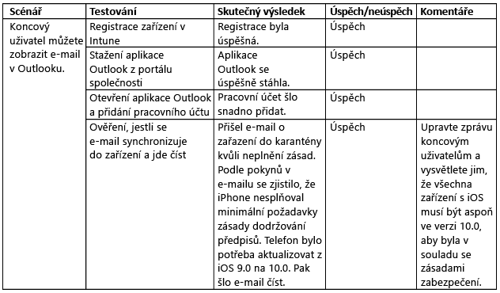

# Testování a ověřování Intune

[!INCLUDE[note for both-portals](../includes/note-for-both-portals.md)]

Testovací fáze by měla probíhat během implementační fáze a po ní. K testování všech požadovaných scénářů pro IT (správci) a koncové uživatele (případy použití) budete potřebovat testovací účty, skupiny a zařízení.

Doporučuje se do testovací fáze zapojit pracovníky IT, kteří mají na starosti podporu/helpdesk, aby byla vytvořena podpůrná dokumentace a tito pracovníci si zvykli na podporou produktu. Pokud fungování součásti nebo scénáře neodpovídá případu použití, popište potřebné změny a uveďte důvod provedené změny.

## Před zahájením

Doporučuje se dokumentovat následující věci:

-   **Testovací kritérium:** Identifikuje srovnávací testy použité k měření.

-   **Součásti návrhu:** Musí existovat alespoň jedno testovací kritérium.

Pokud pro součást návrhu neexistuje aspoň jedno testovací kritérium, které odpovídá požadavku nebo scénáři, zvažte, jestli je tato součást návrhu potřeba. Nezapomeňte si také připravit následující věci:

-   **Účty:** Při testování byste měli používat testovací účty licencované pro EMS a Office 365, aby bylo možné testovat všechny scénáře použití.

-   **Zařízení:** Zařízení, která používáte v tomto okamžiku, by měla být testovací, abyste je mohli případně vymazat nebo na nich obnovit tovární nastavení.

-   **Integrované komponenty:** Všechny integrované komponenty (Certificate Connector, Intune Service to Service Connector pro hostovaný Exchange a konektor Intune pro místní Exchange) by měly být nainstalované a nakonfigurované, pokud jsou potřeba.

V případě nečekaných komplikací možná bude potřeba změnit návrh. Všechny změny návrhu musí být plně dokumentované, včetně důvodu každé změny. Následující příklad ilustruje, o jaký druh změn může jít:

-   Zjistili jste, že nesplňujete požadavky služby zápisu síťových zařízení (NDES). Dále jste zjistili, že ke konfiguraci profilů VPN a Wi-Fi můžete použít kořenovou CA, která vyhovuje stejným požadavkům bez implementace NDES.

Při testování a ověřování se mohou vyskytnout problémy, které vyžadují technickou pomoc nebo odborné řešení potíží. Pokud hledáte pomoc, doporučujeme se obrátit na kanály podpory Microsoftu.

-   [Informace o tom, jak získat podporu pro Intune](https://docs.microsoft.com/intune/troubleshoot/how-to-get-support-for-microsoft-intune)

-   [Obecné tipy pro odstraňování potíží v Microsoft Intune](https://docs.microsoft.com/intune/troubleshoot/general-troubleshooting-tips-for-microsoft-intune)

-   [Informace o tom, jak získat podporu pro Microsoft Intune](https://docs.microsoft.com/intune/troubleshoot/how-to-get-support-for-microsoft-intune)

-   [Kontakt na odbornou telefonickou podporu Microsoft Intune](https://docs.microsoft.com/intune/troubleshoot/contact-assisted-phone-support-for-microsoft-intune)

## Ověřovací testování funkčnosti

Ověřování funkčnosti spočívá v testování každé součásti a konfigurace, abyste zjistili, jestli fungují správně. Příklad testování a ověřování je v následující tabulce.

## Ověřovací testování případů použití

Ověřovací testování případů použití se provádí, aby se ověřilo, zda jsou scénáře použití úplné a funkční. Existují dva typy scénářů použití: správce IT a koncový uživatel.

### Správce IT

Ověřovací testování správce IT se provádí, aby se ověřilo správné fungování akcí při správě zařízení nebo uživatelů. Následující příklad obsahuje scénář koncového ověřování, které provádí správce IT.

### koncový uživatel

Ověřovací testování koncového uživatele se provádí, aby se ověřilo, zda pracovní prostředí koncového uživatele funguje očekávaným způsobem a je správně prezentované při veškeré komunikaci uživatele. Důležité je ověřit správnost prostředí koncového uživatele, protože pokud ho neověříte, může to zhoršit míru osvojení řešení koncovými uživateli a zvýšit počet volání helpdesku.

## Další kroky

Jakmile jste otestovali a ověřili funkce a scénáře použití Intune, jste připraveni zahájit ostrý provoz Intune. Další informace najdete v části [Další materiály a zdroje informací](additional-resources.md).

<!--HONumber=Dec16_HO5-->

