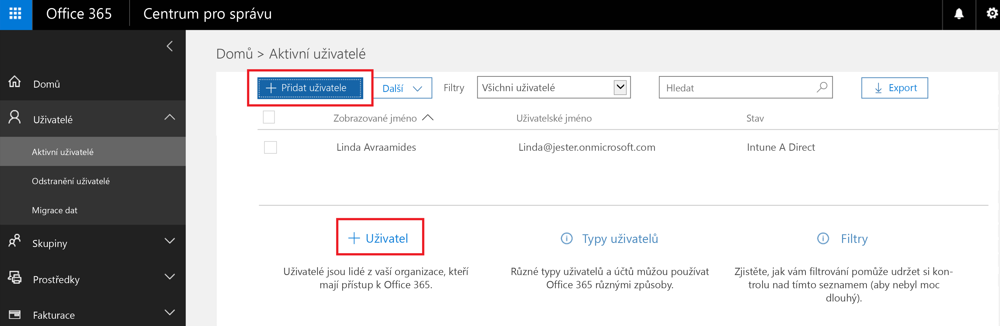
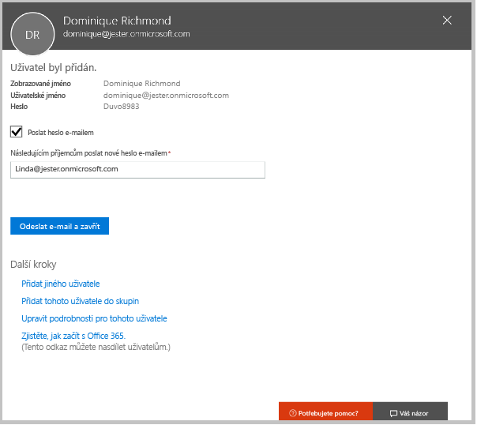
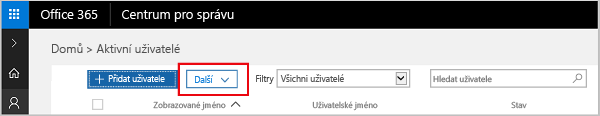
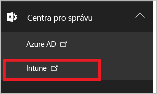
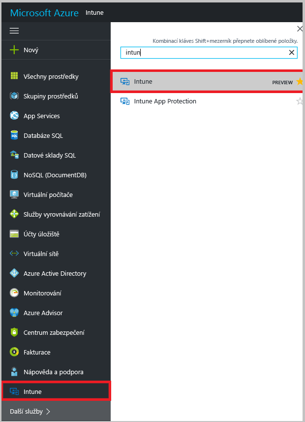

# Registrace bezplatné zkušební verze Microsoft Intune

[!INCLUDE[classic-portal](../includes/classic-portal.md)]

Tento článek vás provede procesem registrace zkušební verze Intune a pomůže vám ve zkušební verzi nastavit uživatele, abyste mohli postupovat podle příručky pro testování a vyzkoušet si, jak se v Intune spravují mobilní zařízení. <!---or app data when devices are not enrolled in Intune.--->

>[!Note]
> Od prosince 2016 se Microsoft Intune přesouvá na portál Azure Portal. Některé registrace bezplatných zkušebních verzí se budou provádět v Intune na portálu Azure Portal, zatímco jiné se budou provádět na portálu Classic služby Intune. Pokud se vaše zkušební verze nachází na portálu Azure Portal, po dokončení postupu uvedeného v tomto článku pro vás bude [obsah Intune Azure Preview](https://docs.microsoft.com/en-us/intune-azure/introduction/what-is-microsoft-intune) užitečnější.

## Předpoklady
Tento článek o registraci a příručka pro testování předpokládají, že zkušební verzi používáte jenom pro účely vyhodnocení a poté, co se přihlásíte k odběru, plánujete použít čisté prostředí.

Abychom vám usnadnili použití zkušební verze, nastavíme velmi jednoduché prostředí, které bude používat jenom Intune a které předpokládá, že toto bude jedinou metodou správy zařízení (označovanou jako autorita pro správu mobilních zařízení). V příručce vás však budeme odkazovat na podrobnější technické informace pro případ, že se budete chtít dovědět více.

Ve zkušební verzi můžete provádět vše, co je možné i v placené verzi. Jediným rozdílem je omezení zkušební verze na 100 uživatelských účtů.

## Zaregistrování zkušební verze
Přejděte na stránku [registrace Intune](https://portal.office.com/Signup/Signup.aspx?OfferId=40BE278A-DFD1-470a-9EF7-9F2596EA7FF9&dl=INTUNE_A&ali=1#0%20) a vyplňte formulář pro registraci zkušebního předplatného.

Pokud máte pracovní nebo školní účet a chcete ho použít pro zkušební verzi Intune, postupujte místo toho podle [těchto pokynů pro přihlášení](https://docs.microsoft.com/en-us/intune/get-started/start-with-a-paid-subscription-to-microsoft-intune-step-1). V tomto článku a příručce pro testování se však předpokládá, že takový účet nepoužíváte.

> [!TIP]
> Pokud se většina pracovníků IT oddělení a uživatelů nachází v jiném národním prostředí než vy, můžete u vaší zkušební verze nastavit toto národní prostředí za účelem testování výkonu.

### Aspekty ke zvážení po registraci
Když se zaregistrujete ke zkušební verzi, přijde vám na e-mailovou adresu, kterou jste zadali při registraci, e-mailová zpráva s informacemi o vašem účtu. Ta potvrzuje, že je vaše zkušební verze aktivní.

Po dokončení procesu registrace budete přesměrováni na stránku, na které můžete přidat uživatele a přiřadit jim licence pomocí Centra pro správu Office 365. Při příštím přihlášení na **portál Classic služby Intune** (https://manage.microsoft.com) budete automaticky přesměrováni do konzoly pro správu Intune.

Pokud se vaše zkušební verze nachází na **portálu Azure Portal**, přejděte na https://portal.azure.com a přihlaste se pomocí přihlašovacích údajů pro zkušební verzi Intune.

## Přidávání uživatelů
Než přejdete z Centra pro správu Office 365 do Intune, je třeba přidat uživatele ke zkušebnímu účtu.

V Centru pro správu Office 365 můžete přidávat uživatele jednotlivě nebo hromadně načtením souboru .csv. Při nastavení vaší zkušební verze použijeme obě možnosti. V produkčním prostředí budete však pravděpodobně chtít využít uživatelské účty služby Azure Active Directory. O této možnosti se můžete dozvědět více v [Příručce Začínáme](https://docs.microsoft.com/en-us/intune/get-started/start-with-a-paid-subscription-to-microsoft-intune-step-3) a v části [Další kroky](#Next-steps) v tomto článku.

### Přidání jednotlivého uživatele
1. Zvolte některou z možností přidání uživatele a otevřete formulář, který umožňuje vytvořit uživatele. Požadované jsou jenom položky s hvězdičkou (\*).

2.  Když přidáte uživatele, odešlete mu v posledním kroku e-mail s dočasným heslem Intune. Pro účely vyhodnocení použijte svoji vlastní pracovní e-mailovou adresu, aby vám přišly přihlašovací údaje a mohli jste si prohlédnout e-mail, který budou dostávat vaši uživatelé. Potom můžete tyto identity uživatelů použít k registraci testovacích zařízení. 

 

3. Pokud chcete vytvořenému uživateli přiřadit roli správce, můžete tuto roli upravit v Centru pro správu Office 365, kde ze seznamu uživatelů vyberete uživatelské jméno tohoto uživatele a pak zvolíte možnost **Upravit** v řádku Role. Zobrazí se seznam rolí uživatelů, které můžete vybrat a přiřadit tomuto uživateli.

 

### Import více uživatelů
1. V seznamu **Další** najdete průvodce pro import více uživatelů.

 

2. Pokud chcete pomoci se správným nastavením souboru .csv, můžete si stáhnou šablonu, do které přidáte data uživatelů. Stáhněte si soubor .csv se záhlavími a ukázkovými informacemi o uživatelích, ve kterém uvidíte, jaká data jsou potřeba pro jednotlivá pole.

 

3. Jakmile vytvoříte a uložíte svůj soubor .csv, zvolte **Procházet** a tento soubor vyberte. Ověřte výběr a zvolte **Další**. Uživatelé se načtou a přidají do vašeho seznamu aktivních uživatelů.

> [!NOTE]
> Uživatelé se v Intune nezobrazí, dokud si nezaregistrují zařízení, které má být spravováno.

Teď už přejděte do Intune, kde můžete začít spravovat svoje uživatele a jejich zařízení a aplikace.

## Přehled prostředí pro správu
### Klasická služba Intune
Pro klasickou službu Intune budete používat dva portály:
- Centrum pro správu Office 365 ([portal.office.com](https://portal.office.com))
- Konzola pro správu Intune ([manage.microsoft.com](https://manage.microsoft.com))

Obvykle budete používat konzolu pro správu Intune, kterou vidíte dole. To je web, na kterém se nastavují a spravují skupiny, zásady, zařízení a aplikace.

Přidávat a spravovat uživatele a pracovat s dalšími aspekty vašeho účtu včetně fakturace a podpory ale budete pomocí Centra pro správu Office 365, které vidíte dole.

Z Centra pro správu Office 365 můžete přejít do Konzoly správce Intune. Odkazy na centra pro správu se nachází pod poslední položkou v levém navigačním podokně. Pokud zvolíte **Intune**, otevře se v nové záložce Konzola správce Intune.

Pokud chcete z Intune přejít zpátky do Centra pro správu Office 365, zvolte **Přidat uživatele** na stránce Přehled skupin.

### Intune Azure preview
Pro Intune Azure Preview budete používat tři portály:
- Centrum pro správu Office 365 ([portal.office.com](https://portal.office.com))
- Řídicí panel Intune v Azure ([portal.azure.com](https://portal.azure.com))
- Klasická konzola pro správu Intune ([manage.microsoft.com](https://manage.microsoft.com))

Při prvním přihlášení k Intune v Azure je možné, že se tato služba na řídicím panelu Azure nezobrazí. Přidání služby Intune na řídicí panel Azure:
1. V seznamu služeb Azure nalevo od řídicího panelu zvolte **Další služby >** a do vyhledávacího pole zadejte Intune.
2. V seznamu zvolte **Intune** a vyberte hvězdičku, aby se tato služba přidala do seznamu služeb.  
3. Výběrem **Intune** v seznamu služeb otevřete řídicí panel Intune.

Obvykle budete používat řídicí panel Intune, který je na obrázku níže. To je web, na kterém se nastavují a spravují skupiny, zásady, zařízení a aplikace. Z řídicího panelu můžete přejít do klasické konzoly pro správu Intune výběrem dlaždice **Otevřít portál Classic služby Intune**. Pokud se chcete vrátit k Intune Azure Preview, zadejte na adresní řádek v prohlížeči https://portal.azure.com a pak v seznamu služeb znovu zvolte **Intune**.

 

Přidávat a spravovat uživatele a pracovat s dalšími aspekty vašeho účtu včetně fakturace a podpory ale budete pomocí Centra pro správu Office 365, které vidíte dole.

K přechodu z Centra pro správu Office 365 na řídicí panel Intune zadejte na adresní řádek v prohlížeči https://portal.azure.com. V seznamu služeb zvolte **Intune**.

K návratu z Intune zpět do Centra pro správu Office 365 zadejte na adresní řádek v prohlížeči https://portal.office.com. Pokud jste už přihlášení do Intune, přejdete přímo do Centra pro správu Office 365.

## Další kroky
### Klasická služba Intune
Scénář hodnocení: [Hodnocení správy mobilních zařízení v Microsoft Intune](mobile-device-management-trial-guide-microsoft-intune.md)

### Intune Azure preview
Přečtěte si další informace o [Intune v Azure Portal Preview](https://docs.microsoft.com/en-us/intune-azure/introduction/what-is-microsoft-intune).

### Integrace s dalšími produkty
Přečtěte si další informace o používání uživatelských účtů služby Azure Active Directory v Intune:
- [Požadavky na identity](https://docs.microsoft.com/en-us/active-directory/active-directory-hybrid-identity-design-considerations-overview#design-considerations-overview)
- [Požadavky na synchronizaci adresáře](https://docs.microsoft.com/en-us/active-directory/active-directory-hybrid-identity-design-considerations-directory-sync-requirements)
- [Požadavky na vícefaktorové ověřování](https://docs.microsoft.com/en-us/active-directory/active-directory-hybrid-identity-design-considerations-multifactor-auth-requirements)

Přečtěte si další informace o používání [Intune s nástrojem System Center Configuration Manager.](https://docs.microsoft.com/en-us/sccm/mdm/understand/hybrid-mobile-device-management)

<!--HONumber=Dec16_HO3-->

