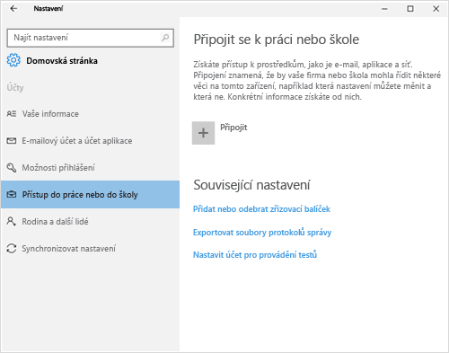
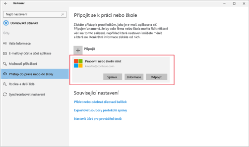
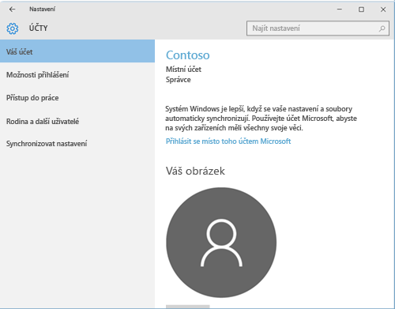

# Registrace zařízení s Windows 10 pomocí portálu společnosti Intune

Registrace zařízení s Windows 10 v rámci správy vaší organizace pomocí portálu společnosti Intune. Tento článek popisuje, jak zaregistrovat zařízení s Windows 10 verze 1607 a novější a Windows 10 verze 1511 a starší. Než začnete, ujistěte se, že jste [ověřit verzi na zařízení s](windows-enrollment-company-portal.md#find-windows-10-version-number) tak, aby provedením správným krokům.  

Windows 10 je podporována mezi různé typy zařízení, včetně desktop, telefonu a tabletu. Kroky registrace se stejný libovolným zařízením, které používáte. Vaše obrazovka může vypadat trochu liší od bitové kopie, uvidíte v tomto článku.  

> [!VIDEO https://channel9.msdn.com/Series/IntuneEnrollment/Windows-Enrollment/player]  

## Registrace Windows 10 verze 1607 a novější zařízení 
Tyto kroky popisují, jak zaregistrovat zařízení, která běží na Windows 10 verze 1607 a novější.  

1. Přejděte na **Start**. Pokud jste na zařízení s Windows 10 Mobile, pokračujte **všechny aplikace** seznamu.

2. Otevřít **nastavení** aplikace. Není-li aplikace snadno k dispozici v seznamu aplikací, přejděte na panel hledání a zadejte "nastavení".

3. Vyberte **Účty** > **Přístup do práce nebo do školy** > **Připojit**.  

      

4. Zadejte svou pracovní nebo školní e-mailovou adresu a pak vyberte **Další**.  

     

5. Přihlaste se k Intune ze svého pracovního nebo školního účtu.  

      

    Nakonec uvidíte zprávu, že vaše společnost nebo škola registruje vaše zařízení.

6. Pokud vaše organizace vyžaduje, abyste nastavili PIN kód pro Windows Hello, budete vyzváni k zadání ověřovacího kódu. Zadejte kód a bude pokračovat až na obrazovce kroky k vytvoření PIN kódu.  

7. Na **všechno je připravené!** vyberte **Hotovo**. Právě jste svoje zařízení zaregistrovali.  

8. Chcete-li zkontrolovat připojení, přejděte zpět na **nastavení** > **účty** > **přístup do práce nebo do školy**.  Váš účet by teď měla být uvedena.  

      

Stále nemáte přístup k pracovním nebo školním e-mailům, souborům nebo jiným datům? Zjistěte, jak [Poradce při potížích účet](troubleshoot-your-windows-10-device-windows.md#troubleshooting-steps-to-follow-if-you-see-access-work-or-school).  

## Registrace Windows 10 verze 1511 a starší zařízení  
Tyto kroky popisují, jak zaregistrovat zařízení, která běží na Windows 10 verze 1511 a starší.  

1. Přejděte na **Start**. Pokud jste na zařízení s Windows 10 Mobile, pokračujte **všechny aplikace** seznamu.

2. Otevřít **nastavení** aplikace. Není-li aplikace snadno k dispozici v seznamu aplikací, přejděte na panel hledání a zadejte "nastavení".

3. Vyberte **účty** > **účtu**.  

      

5. Vyberte **Přidat pracovní nebo školní účet**.  

      

6. Přihlaste se pomocí přihlašovacích údajů svého pracovního nebo školního účtu.  

      

Stále nemáte přístup k pracovním nebo školním e-mailům, souborům nebo jiným datům? Zjistěte, jak [Poradce při potížích účet](troubleshoot-your-windows-10-device-windows.md#troubleshooting-steps-to-follow-if-you-see-your-account).   

## Další postup  

Potřebujete pomoc, obraťte se na svou firemní podporu. Můžete najít vaše organizace IT o [webu portál společnosti](https://go.microsoft.com/fwlink/?linkid=2010980). Přihlaste se k webu pomocí svého pracovního nebo školního účtu.  

 

