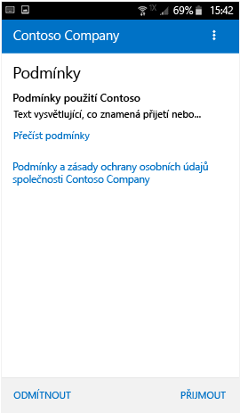
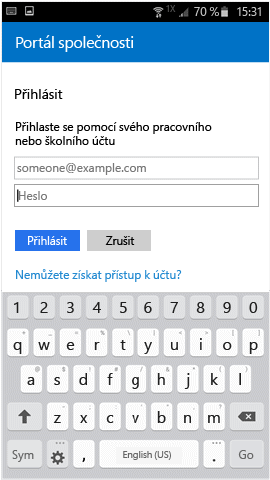

# Registrace zařízení se systémem Android do Intune

Pokud vaše společnost nebo škola používá Microsoft Intune, můžete svoje zařízení s Androidem zaregistrovat a získat tak přístup k e-mailům, souborům a dalším prostředkům společnosti. Když si svoje zařízení zaregistrujete, může vaše IT oddělení tyto pracovní nebo školní prostředky spravovat, udržovat je v bezpečí a zároveň vám umožnit, abyste k plnění úkolů používali zařízení, které preferujete. Další informace o registraci najdete v tématu [Co se stane, když nainstaluji aplikaci Portál společnosti a zaregistruji zařízení?](what-happens-if-you-install-the-Company-Portal-app-and-enroll-your-device-in-intune-android.md).

> [!VIDEO https://channel9.msdn.com/Series/IntuneEnrollment/Android-Enrollment/player]

Tyto pokyny k registraci jsou určené pro nativní zařízení s Androidem a pro zařízení se sadou Samsung KNOX. Samsung KNOX je typ zabezpečení, které určitá zařízení Samsung používají k zajištění další ochrany nad rámec toho, co poskytuje nativní Android. Pokud chcete zjistit, jestli máte zařízení Samsung KNOX, přejděte na **Nastavení** > **O zařízení**. Pokud se tu nezobrazí verze Knoxu, máte nativní zařízení s Androidem.

Před registrací nebo po ní se může zobrazit výzva k výběru kategorie, která nejlépe vystihuje způsob použití vašeho zařízení. Tato kategorie pomůže firemní podpoře zkontrolovat aplikace, ke kterým máte přístup.

**Postup při registraci zařízení se systémem Android:**

1.  Nainstalujte si bezplatnou aplikaci Portál společnosti Intune z [Google Play](http://play.google.com/store/apps/details?id=com.microsoft.windowsintune.companyportal).

2.  Otevřete aplikaci Portál společnosti.

3.  Na **úvodní** obrazovce aplikace Portál společnosti klepněte na **Přihlásit se** a pak se přihlaste pomocí svého pracovního nebo školního účtu.

       

4.  Pokud firemní podpora nastavila firemní podmínky a ujednání, přijměte je klepnutím na **PŘIJMOUT**. V závislosti na verzi Androidu, kterou aktuálně používáte, se může tato obrazovka nepatrně lišit od té, která je znázorněná níže.

    

5.  Přihlaste se k aplikaci Portál společnosti zadáním svého pracovního nebo školního účtu a hesla a potom klepněte na **Přihlásit se**.

    

6.  Na obrazovce **Nastavení firemního přístupu** klepněte na **POKRAČOVAT**.

    

    > [!NOTE]
    > Žluté trojúhelníky neznamenají, že už došlo k chybě. Tyto ikony označují, že ještě existují kroky, které se musí v procesu registrace dokončit.

7.  Prohlédněte si seznam toho, co firemní podpora na vašem zařízení uvidí nebo neuvidí, a klepněte na **POKRAČOVAT**.

    

9.  Na obrazovce **Co dál?** si přečtěte, co probíhá během registrace, a potom klepněte na **REGISTROVAT**.

    

10.  Pokud používáte Android 6.0 nebo novější, proveďte tento krok. V opačném případě přejděte k dalšímu kroku.

    Pokud firemní podpora nastavila konkrétní zásady, mohou se zobrazit následující zprávy:
    -   **Povolit pro Portál společnosti telefonování a správu telefonních hovorů?**

        

    Pokud se zobrazí tato zpráva, klepněte na **POVOLIT**. Na POVOLIT můžete bezpečně klepnout, protože **Microsoft za vás nikdy netelefonuje, ani nespravuje vaše telefonní hovory**. Text zprávy určuje společnost Google a Microsoft ho nemůže změnit. Pokud přístup povolíte, umožníte, aby zařízení poslalo do Intune svoje číslo IMEI (International Mobile Equipment Identity). Číslo IMEI je něco jako sériové číslo, které jednoznačně identifikuje mobilní zařízení.

    Pokud přístup odmítnete, zobrazí se tato zpráva znovu při příštím přihlášení k portálu společnosti, ale další zprávy můžete vypnout zaškrtnutím políčka **Příště se už neptat**. Pokud se později rozhodnete povolit přístup, použijte možnost **Nastavení** &gt; **Aplikace** &gt; **Portál společnosti** &gt; **Oprávnění** &gt; **Telefon** a tato oprávnění aktivujte.

    -   **Povolit pro Portál společnosti přístup k vašim kontaktům?**

        

        Pokud se zobrazí tato zpráva, klepněte na **POVOLIT**. Na POVOLIT můžete bezpečně klepnout, protože **Microsoft nikdy nevyužívá přístup k vašim kontaktům**. Text zprávy určuje společnost Google a Microsoft ho nemůže změnit. Pokud přístup povolíte, umožníte aplikaci Portál společnosti jenom vytvářet, používat a spravovat váš pracovní účet.

        Pokud přístup odmítnete, zobrazí se tato zpráva znovu při příštím přihlášení k portálu společnosti, ale další zprávy můžete vypnout zaškrtnutím políčka **Příště se už neptat**. Pokud se později rozhodnete povolit přístup, použijte možnost **Nastavení** &gt; **Aplikace** &gt; **Portál společnosti** &gt; **Oprávnění** &gt; **Telefon** a tato oprávnění aktivujte.

11.  Na obrazovce **Aktivovat správce zařízení** klepněte na **Aktivovat**.

    

    Portál společnosti potřebuje ke správě vašeho zařízení roli správce zařízení. Ta umožňuje vašemu správci například zobrazit si, kolikrát jste se pokusili odemknout obrazovku a provést nějaké akce.

    Je důležité si zapamatovat, že tyto akce se provádí ve jménu bezpečnosti. Vaše firemní podpora se nesnaží vám bezdůvodně narušit soukromí nebo vymazat informace, ale chce se ujistit, že jsou firemní data v bezpečí.

    Microsoft tuto zprávu nemůže nijak ovlivnit a rozumíme, že její formulace se může zdát poněkud radikální. Neexistuje žádný způsob, kterým by Portál společnosti mohl zobrazovat omezení a přístup, které jsou relevantní pouze pro vaši organizaci. Na této obrazovce je udělujete všechny najednou. Pokud máte otázky týkající se použití konkrétně ve své organizaci, požádejte o další informace firemní podporu (pomocí kontaktních informací na [webu Portál společnosti](https://portal.manage.microsoft.com)).

12.  Podle pokynů zadejte kód PIN nebo heslo. Pokud jste už kód PIN nebo heslo v daném zařízení nastavili, tato obrazovka se buď neobjeví, nebo budete muset zadat nový kód PIN a heslo.

    

13.  Pokud používáte zařízení Samsung KNOX, klepněte na **Potvrdit** a zobrazí se zpráva o registraci zařízení. Pokud používáte nativní zařízení s Androidem, všimnete si jenom následující obrazovky, která označuje, že vaše zařízení se registruje.

    

    Tato obrazovka informuje o registraci zařízení.

    

14. Když se zobrazí stránka **Nastavení firemního přístupu**, klepněte na **POKRAČOVAT**. Pokud se zobrazí zpráva, že vaše zařízení nedodržuje předpisy, podle pokynů tento problém vyřešte a pak klepněte na **POKRAČOVAT**.

    

    

    Další informace o problémech zjistíte, když na ně klepnete.

    

      

15. Na obrazovce **Nastavení firemního přístupu je hotové** klepněte na **HOTOVO**. Právě jste svoje zařízení zaregistrovali.

    

Než začnete instalovat firemní aplikace, přejděte na **Nastavení** &gt; **Zabezpečení** a zapněte **Neznámé zdroje**. Pokud před instalací firemních aplikací tuto možnost nezapnete, zobrazí se tato zpráva: „Instalace blokována. Z důvodů zabezpečení je v zařízení nastavené blokování instalací pro aplikace získané z neznámého zdroje.“ Klepnutím na **Nastavení** v dialogovém okně s chybou můžete přejít na možnost **Neznámé zdroje**.

> [!Note]
> Pokud vaše organizace používá software pro správu telekomunikačních výdajů (Telecom Expense Management), budete muset před úplnou registrací zařízení provést několik dalších kroků. Další informace najdete [tady](enroll-your-device-with-telecom-expense-management-android.md).

Pokud se při registraci zařízení do služby Intune zobrazí chybová zpráva, můžete [chyby při registraci odeslat firemní podpoře](send-enrollment-errors-to-your-it-admin-android.md).

Potřebujete ještě další pomoc? Obraťte se na firemní podporu (kontaktní údaje najdete na [webu Portál společnosti](https://portal.manage.microsoft.com)) nebo napište <a href="mailto:wintunedroidfbk@microsoft.com?subject=I'm having trouble with enrolling my Android device&body=Describe the issue you're experiencing here.">týmu Microsoft Android</a>.
