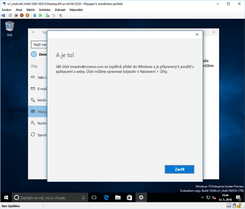

# Registrace zařízení s Windows 10 v Intune

<iframe src="https://channel9.msdn.com/Series/IntuneEnrollment/Windows-Enrollment/player" width="960" height="540" allowFullScreen frameBorder="0"></iframe>

1.  Otevřete aplikaci **Nastavení** Windows – přejděte na **nabídku Start** a vyberte tlačítko **Nastavení**. Můžete také pomocí panelu hledání vyhledat „nastavení“.

2. Vyberte **Účty** > **Přístup do práce nebo do školy** > **Připojit**.

    

3.  Zadejte svou pracovní nebo školní e-mailovou adresu a pak vyberte **Další**.

    

4. Přihlaste se k Intune ze svého pracovního nebo školního účtu.

    

    Zobrazí se zpráva, že organizace nebo škola registruje vaše zařízení.

5. Když se zobrazí stránka **Všechno máte nastavené**, vyberte možnost **Zavřít**. Máte hotovo.

  

6. Pokud chcete zkontrolovat, zda je připojení skutečně v pořádku, vraťte se k **Nastavení**, kde by měl být nyní uvedený váš pracovní nebo školní účet.

    

Pokud jste použili výše uvedené kroky, ale pořád nemáte přístup ke svému pracovnímu e-mailovému účtu nebo souborům, použijte kroky v části [Postup řešení potíží, pokud se zobrazí Přístup do práce nebo do školy](troubleshoot-your-windows-10-device-windows.md#troubleshooting-steps-to-follow-if-you-see-access-work-or-school).

