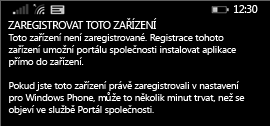

# Registrace zařízení s Windows Phone 8.1 v Intune  

Zaregistrujte svoje zařízení získat přístup k pracovní nebo školní e-mail, soubory a další prostředky. Když svoje zařízení zaregistrujete, dokáže vaše organizace uchovat firemní data v bezpečí. Další informace o registraci najdete v tématu [Co se stane, když nainstaluji aplikaci Portál společnosti a zaregistruji zařízení v Intune](what-happens-if-you-install-the-company-portal-app-and-enroll-your-device-in-intune-windows.md) a v tématu [Co má a nemá firemní podpora oprávnění vidět na vašem zařízení](what-info-can-your-company-see-when-you-enroll-your-device-in-intune.md).  

Registrace zařízení v Intune, postupujte podle sadu instrukcí, které odpovídají oprávnění nebo aktuální stav účtu.

## Registrace prostřednictvím portálu společnosti  
Pokud nainstalujete aplikaci portál společnosti z Microsoft Store, postupujte podle těchto kroků. 

1. Klepněte na **Start** > **Store**.  

2. Klepněte na **Hledat** a napište **portál společnosti**.  

3. V seznamu výsledků klepněte na **Portál společnosti**.  

      

4. Klepněte na **Portál společnosti** &gt; **Instalovat**.  

      

Zaregistrujte své zařízení:  

1. V zařízení otevřete aplikaci **Portál společnosti Microsoft Intune**.  

2. Zadejte svoje přihlašovací údaje. V odpovídajících případech můžete být vyzváni, abyste přijali podmínky a ujednání vaší společnosti.  

3. Potažením prstem přejděte na **Moje zařízení**.  

4. Vyberte **klepněte sem a můžete zaregistrovat nebo identifikovat toto zařízení**.  

      

5. Klepněte na **Zaregistrovat toto zařízení**.  

      

6. Klepněte na **Přidat účet**.  

      

7. Podle potřeby zadejte další informace a klepnutím na **Přihlásit se** dokončete registraci. Teď byste měli vidět účet pracoviště na stránce **Nastavení** &gt; **Pracoviště**.  

      

## Registrace prostřednictvím nastavení aplikace  
Následující postup, pokud nemá přístup k Microsoft Store ze zařízení s Windows Phone, nebo pokud nemáte Account Microsoft.

1. Klepněte na **Nastavení** &gt; **Pracoviště**.  

2. Klikněte na **Přidat účet** a potom se přihlaste pomocí svého pracovního účtu.  

3. Podle potřeby zadejte další informace a klepnutím na **Přihlásit se** dokončete registraci.  

4. Pokud se zobrazí výzva k instalaci firemní aplikace nebo firemního centra, zaškrtněte odpovídající políčko a potom klepněte na **Hotovo**.  

Pokud vaše firemní podpora nastavila Portál společnosti tak, aby se nainstaloval během registrace, zobrazí se Portál společnosti ve vašem seznamu aplikací.  

Potřebujete ještě další pomoc? Obraťte se na podporu ve vaší společnosti. Jeho kontaktní údaje najdete na [webu Portál společnosti](https://go.microsoft.com/fwlink/?linkid=2010980).
