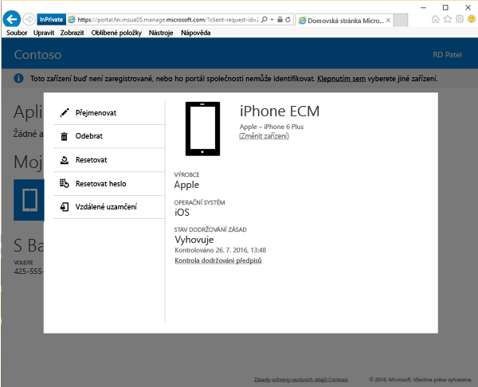

# Odebrat zařízení z portálu společnosti

Pokud už nechcete, aby vaše zařízení spravovala vaše společnost nebo organizace, můžete ho odebrat z odebrat z portálu společnosti pomocí [webu Portál společnosti](http://portal.manage.microsoft.com). Web Portál společnosti je webová stránka sloužící ke správě počítačů a zařízení, jejichž správu jste si zaregistrovali u svého IT oddělení. Pokud zařízení odeberete, nebude nadále uvedené na Portálu společnosti a můžete také ztratit přístup k firemním nebo školním datům, aplikacím a e-mailům.

Odebrání zařízení:

1.    Na [webu Portál společnosti](http://portal.manage.microsoft.com) klepněte na tlačítko __nabídky__  a potom vyberte __Moje zařízení__.

  

2. Na stránce __Moje zařízení__ vyberte název zařízení, které chcete odebrat.

    

3.    Zařízení se otevře v místním okně. Klepněte na tlačítko **Odebrat**.

      

4. Přečtěte si zprávu s upozorněním a klepnutím na **Odebrat** zařízení odeberte z portálu společnosti.

Potřebujete ještě další pomoc? Obraťte se na správce IT. Kontaktní údaje najdete na [webu Portál společnosti](http://portal.manage.microsoft.com).

