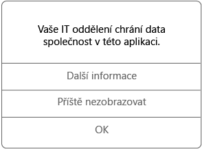

# Použití spravovaných aplikací na zařízení s iOSem

Spravované aplikace jsou aplikace, které může vaše firemní podpora nastavit tak, aby lépe chránily firemní data, ke kterým v dané aplikaci získáváte přístup. Pokud získáváte přístup k datům ve spravované aplikaci v zařízení s iOSem, můžete si všimnout, že aplikace funguje trochu jinak, než čekáte. Nebudete třeba moct kopírovat a vkládat chráněná firemní data nebo tato data nebudete moct uložit do určitých umístění.

Několik spravovaných aplikací také může na vašem zařízení spolupracovat, abyste mohli provádět běžné úkoly při zachování ochrany firemních dat. Například pokud otevřete firemní soubor v jedné spravované aplikaci a k jeho zobrazení je potřeba jiná spravovaná aplikace, automaticky se otevře spravovaná aplikace, která umožňuje zobrazení souboru. Pokud není požadovaná aplikace dostupná, nemusíte mít přístup k určitým akcím, jako je otevření dokumentu nebo přístup k webovému odkazu ze spravovaného dokumentu.

Při přístupu k firemním datům ve spravované aplikaci se zobrazí zpráva podobná té následující, která oznamuje, že otevíráte spravovanou aplikaci.

## Jak získám spravované aplikace?  
Spravované aplikace můžete získat několika různými způsoby:

-   Při registraci zařízení v Microsoft Intune buď nainstalujete aplikaci z aplikace Portál společnosti nebo webu Portál společnosti, nebo ji na vaše zařízení nainstaluje firemní podpora. Další informace o registraci najdete v tématu [Registrace zařízení s macOS do Intune](enroll-your-device-in-intune-ios.md) nebo [Registrace zařízení s iOSem do Intune](enroll-your-device-in-intune-macos.md).

-   Nainstalujte aplikaci z App Storu a potom se přihlaste pomocí svého firemního uživatelského účtu spravovaného službou Intune.

Vaše firemní podpora může někdy nakoupit pro aplikaci, kterou instalujete, více licencí. Pokud se zobrazí zpráva, že máte přijmout smlouvu Apple Volume Purchase Program, není to nic nezvyklého a můžete ji přijmout. Pokud ji nepřijmete, nebudete si moct aplikaci nainstalovat.

## Dostupné aplikace   
 Vaše organizace vybere aplikace, které jsou vhodné a užitečné si v práci nebo škole. Tyto aplikace jsou pouze ty, které najdete na portálu společnosti.   

 Aplikace jsou také k dispozici na základě typu vašeho zařízení. Například pokud používáte aplikaci portál společnosti pro iOS, budete mít přístup do aplikace pro iOS, ale ne na Android apps.   

## Žádost o aplikaci pro práci nebo školu   
 Pokud je aplikace potřebujete, ale nezobrazuje v aplikaci portál společnosti, můžete požádat o jeho. Najít kontaktní údaje pro váš **helpdesku** v aplikaci portál společnosti **podporu** kartu. Stejné kontaktní údaje najdete na [webu portál společnosti](https://go.microsoft.com/fwlink/?linkid=2010980).   
 

## Co může firemní podpora spravovat v mé aplikaci?  
Tady jsou některé příklady možností, které může firemní podpora spravovat v aplikaci a které můžou ovlivnit vaši interakci s firemními daty na zařízení:

-   Přístup k určitým webům

-   Přenos dat mezi aplikacemi

-   Ukládání souborů

-   Operace kopírování a vkládání

-   Požadavky na přístup chráněný kódem PIN

-   Vaše přihlášení pomocí přihlašovacích údajů společnosti

-   Schopnost zálohovat do cloudu

-   Schopnost pořizovat snímky obrazovky

-   Požadavky na šifrování dat

Další informace o spravovaných aplikacích na vašem zařízení vám poskytne firemní podpora. Kontaktní údaje najdete na [webu Portál společnosti](https://go.microsoft.com/fwlink/?linkid=2010980).
