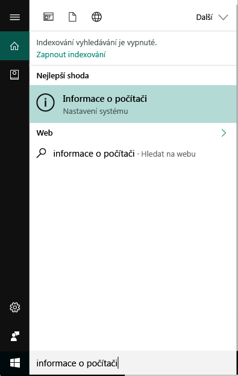
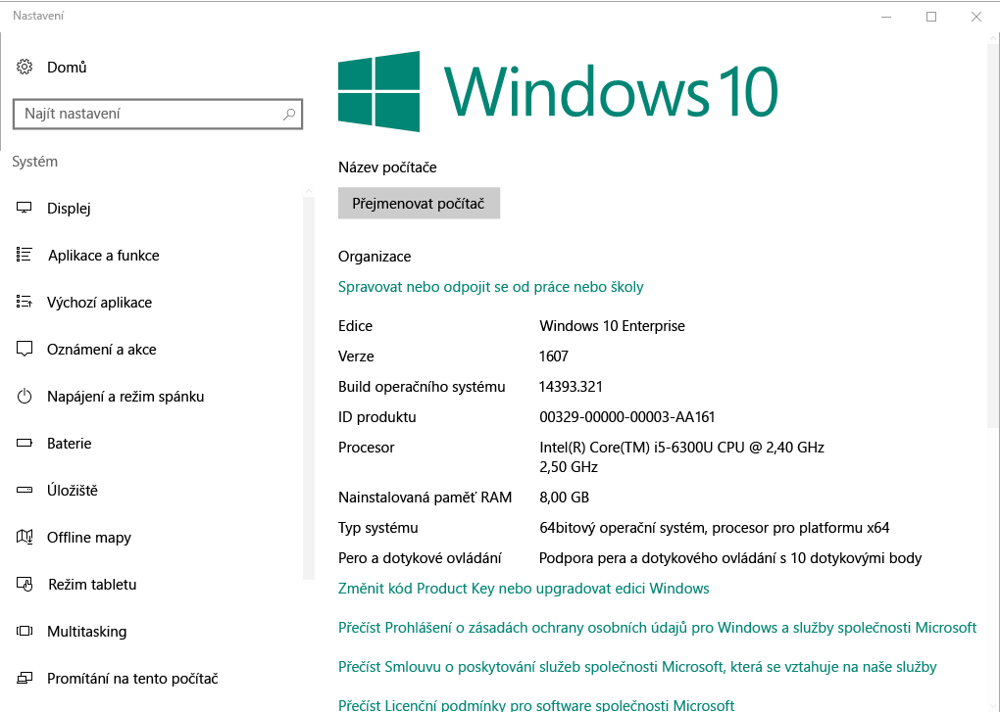

# Registrace zařízení Windows v portálu společnosti Intune  

Registrace zařízení s Windows v aplikaci portál společnosti Intune a získat zabezpečený přístup k pracovním a školním aplikacím, e-mailů a souborům. Pokud vaše organizace vyžaduje, nebo doporučuje některé aplikace, jako je Office nebo OneDrive, vám buď je při registraci, nebo budou k dispozici v aplikaci portál společnosti po registraci.  

Můžete zaregistrovat zařízení s Windows 10 prostřednictvím webu portál společnosti *nebo* aplikace. Pokud se při registraci zařízení se starší verzí systému Windows, musíte se zaregistrovat zařízení pomocí webu portál společnosti.  

## Aplikace portál společnosti nainstalovat  
Již můžete mít v zařízení nainstalovanou aplikaci portál společnosti. Zkontrolujte aplikace vaše __všechny aplikace__ seznamu.  Pokud nevidíte v seznamu aplikací portál společnosti, postupujte podle těchto kroků k její instalaci.  

1. Otevřít **Microsoft Store** na vašem zařízení.

2. V **hledání** zadejte **portál společnosti**.

3. V seznamu výsledků vyberte **Portál společnosti** > **Instalovat**.

4. Vyberte buď **Instalovat**, nebo **Zdarma**. Není žádný rozdíl mezi těmito dvěma možnostmi; Zobrazí závislosti na tom, jak vaše organizace nastavit aplikaci slova.  

## Najít číslo verze Windows 10  
Postup registrace lišit pro různé verze zařízení s Windows 10. Následující kroky popisují, jak najít číslo verze na Windows 10 desktop a mobilní zařízení. Až budete vědět, vaše verze, pokračujte kroky doporučené registrace.  

### Zařízení s Windows 10 Desktop  

1. Přejděte na **Start**.

2. Na panelu hledání zadejte "informace o"počítači. Vyberte __informace o počítači__ ve výsledcích.  

     

3. Přejděte dolů k položce **specifikace Windows** najít **verze** Windows 10, která je nainstalovaná ve vašem počítači.  

     

4. Pokud je vaše verze  

    *  __1607 nebo novější__: Registrace zařízení prostřednictvím [ **nastavení** > **účet** > **přístup do práce nebo do školy** trasy](enroll-windows-10-device.md#enroll-windows-10-version-1607-and-later-device).   
    * __1511 nebo starší__: Registrace zařízení prostřednictvím [ **nastavení** > **účet** > **účtům** trasy](enroll-windows-10-device.md#enroll-windows-10-version-1511-and-earlier-device).  

### Zařízení s Windows 10 Mobile       

1.  Přejděte na __všechny aplikace__ a vyberte __nastavení__ aplikace.  
2.  Vyberte __Systém__ > __O systému__.      
3.  V části __informace o zařízení__, vyhledejte __verze__.  
4. Pokud je vaše verze  

    *  __1607 nebo novější__: Registrace zařízení pomocí [ **nastavení** > **přístup do práce nebo do školy** trasy](enroll-windows-10-device.md#enroll-windows-10-version-1607-and-later-device).   
    * __1511 nebo starší__: Registrace zařízení pomocí [ **nastavení** > **účty** trasy](enroll-windows-10-device.md#enroll-windows-10-version-1511-and-earlier-device).  

## Registrace zařízení bez Windows 10  
K registraci ostatní podporovaná zařízení Windows pomocí webu portál společnosti použijte v následujících článcích:   
* [Windows 8.1. nebo zařízení s Windows RT 8.1](enroll-your-W81-or-rt81-windows.md)  
* [Zařízení Windows Phone 8.1](enroll-your-wp81-windows.md)    

## Další postup  
Když teď víte, že podporovaná zařízení a číslo verze Windows 10, přejděte k článku doporučené registrace.  
 
Další informace o správě zařízení portál společnosti, a obě použití škol a v práci, najdete v následujících článcích:  
* [Pomocí spravovaných zařízení přístup do práce nebo škola prostředků](use-managed-devices-to-get-work-done.md)  
* [Co se stane při registraci zařízení v Intune](what-happens-if-you-install-the-company-portal-app-and-enroll-your-device-in-intune-windows.md)  
* [Jaké informace Moje organizace uvidí, když zaregistruji své zařízení?](what-info-can-your-company-see-when-you-enroll-your-device-in-intune.md)  

Potřebujete pomoct? Obraťte se na podporu ve vaší společnosti. [Přejděte na web portál společnosti](https://go.microsoft.com/fwlink/?linkid=2010980) najít vaše organizace IT kontaktní informace.  
